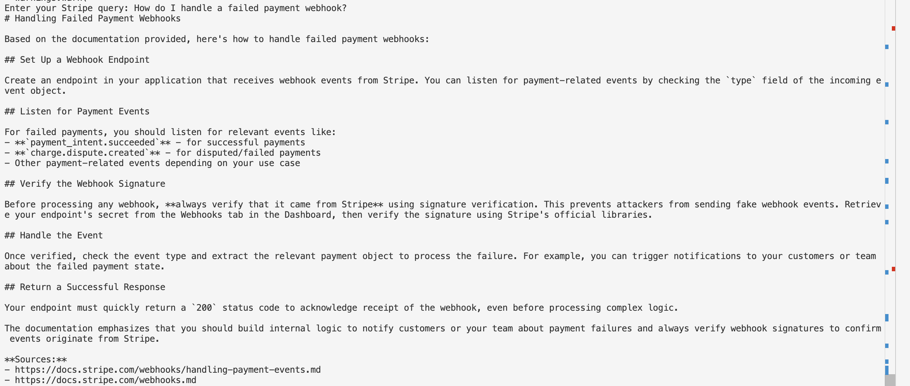
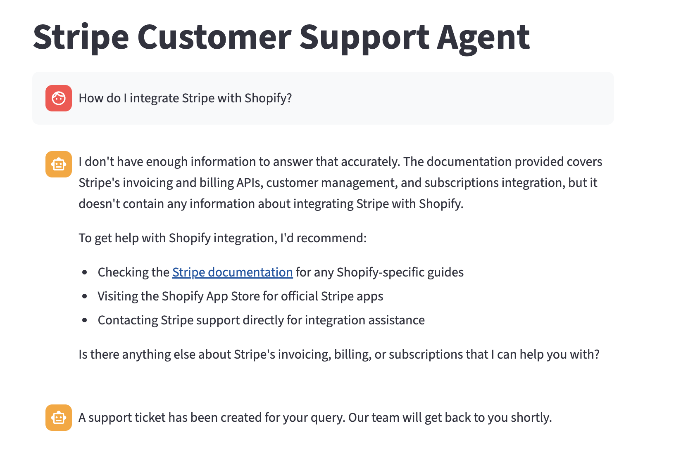
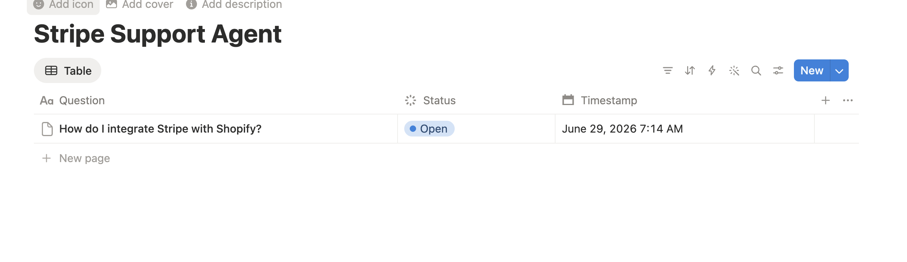

# Stripe RAG Support Agent

A RAG-powered customer support agent built on Stripe's public documentation. 
Ask questions about payments, webhooks, subscriptions, and billing — 
get answers grounded in real Stripe docs with source citations. 
Unanswerable questions automatically escalate to a Notion support ticket.

## Demo

### Chat Interface


### Multi-turn Conversation with Memory
.png)
.png)
.png)

### Automatic Ticket Escalation



## The Problem

Stripe's documentation is extensive and spread across dozens of pages. Finding 
the right answer means knowing where to look, reading through long guides, and 
piecing together information from multiple sources. This agent lets developers 
ask questions in plain English and get answers grounded directly in Stripe's 
official docs, with source citations so every answer is verifiable, conversation 
memory so follow-up questions work naturally, and automatic escalation to a 
support ticket when the question falls outside the knowledge base.

## How It Works

**Build time** (run once to build the knowledge base): 
Stripe docs → fetch → chunk → embed → ChromaDB

**Query time** (runs on every question):
User question → embed → semantic search → top 5 chunks → Claude → answer + sources

The key is the semantic search step. Rather than keyword matching, the question 
is converted to a vector and compared against 148 embedded chunks of Stripe 
documentation. Similar meaning maps to nearby vectors — so "why did my charge 
fail" retrieves the declines documentation even though those exact words don't 
appear there.

When Claude can't answer confidently from the retrieved context, it says so 
instead of guessing — and a Notion ticket is automatically created for human 
follow-up.

## Architecture

| Component | Tool | Why |
|-----------|------|-----|
| Embedding model | `all-MiniLM-L6-v2` | Free, runs locally, optimized for semantic similarity |
| Vector database | ChromaDB | Local, persistent, zero setup |
| LLM | Claude Haiku 4.5 | Fast and cost-efficient for support queries |
| UI | Streamlit | Python-native, no frontend code needed |
| Ticket escalation | Notion API | Real integration, visible during demos |

## Features

- **Semantic search** — finds relevant docs by meaning, not keywords
- **Source citations** — every answer includes the Stripe docs pages it used
- **Multi-turn memory** — follow-up questions understand prior context
- **Confidence handling** — says "I don't know" instead of hallucinating
- **Notion escalation** — automatically creates a support ticket for unanswerable questions

## Project Structure

```
stripe-rag-agent/
├── app.py                      # Streamlit chat UI with session state
├── scripts/
│   ├── ingest.py              # Fetch, chunk, embed Stripe docs → ChromaDB
│   ├── query.py               # Semantic search + Claude API integration
│   └── notion_ticket.py       # Notion API ticket creation
├── chroma_db/                 # Persistent vector database (auto-created)
├── assets/                    # Screenshots for README
├── requirements.txt           # Python dependencies
└── .env                       # API keys (not tracked in git)
```

## Getting Started

### Prerequisites
- Python 3.9+
- Anthropic API key ([get one here](https://console.anthropic.com/))
- Notion API key + Database ID ([setup guide](https://developers.notion.com/docs/create-a-notion-integration))

### Installation

1. **Clone the repository**
   ```bash
   git clone https://github.com/yourusername/stripe-rag-agent.git
   cd stripe-rag-agent
   ```

2. **Create virtual environment**
   ```bash
   python -m venv venv
   source venv/bin/activate  # On Windows: venv\Scripts\activate
   ```

3. **Install dependencies**
   ```bash
   pip install -r requirements.txt
   ```

4. **Set up environment variables**
   
   Create a `.env` file in the project root:
   ```env
   ANTHROPIC_API_KEY=your_anthropic_key_here
   NOTION_API_KEY=your_notion_key_here
   NOTION_DATABASE_ID=your_database_id_here
   ```

5. **Build the knowledge base** (run once)
   ```bash
   python scripts/ingest.py
   ```
   This fetches ~20 Stripe documentation pages, chunks them, generates embeddings, and stores them in ChromaDB. Takes ~1-2 minutes.

6. **Launch the chat UI**
   ```bash
   streamlit run app.py
   ```
   Opens at `http://localhost:8501`

### Usage

**Ask Stripe-related questions:**
- "How do I handle webhooks?"
- "What's the difference between payment intents and charges?"
- "How do I cancel a subscription?"

**Multi-turn conversations work naturally:**
```
You: How do I test subscriptions?
Agent: [explains with test card numbers]
You: What about failed payments?
Agent: [continues in context of subscription testing]
```

**Out-of-scope questions:**
The agent will politely redirect you if you ask non-Stripe questions (e.g., "What's the weather?") and explain its capabilities.

**Uncertain answers:**
When the agent can't answer confidently from the docs, it says "I don't have enough information" and a Notion ticket is auto-created for escalation.

### Alternative: CLI Mode

Run queries from the command line:
```bash
python scripts/query.py
```

